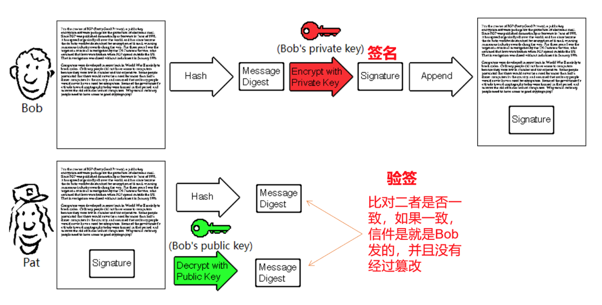
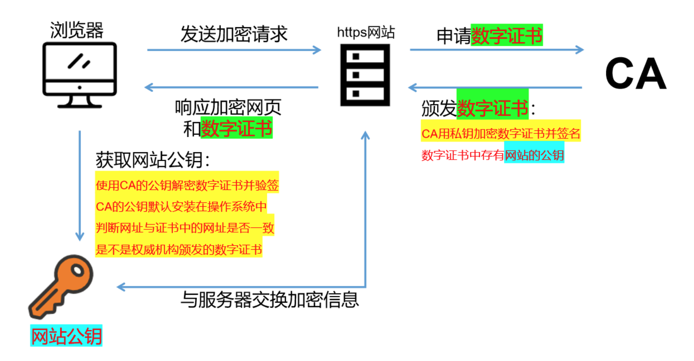
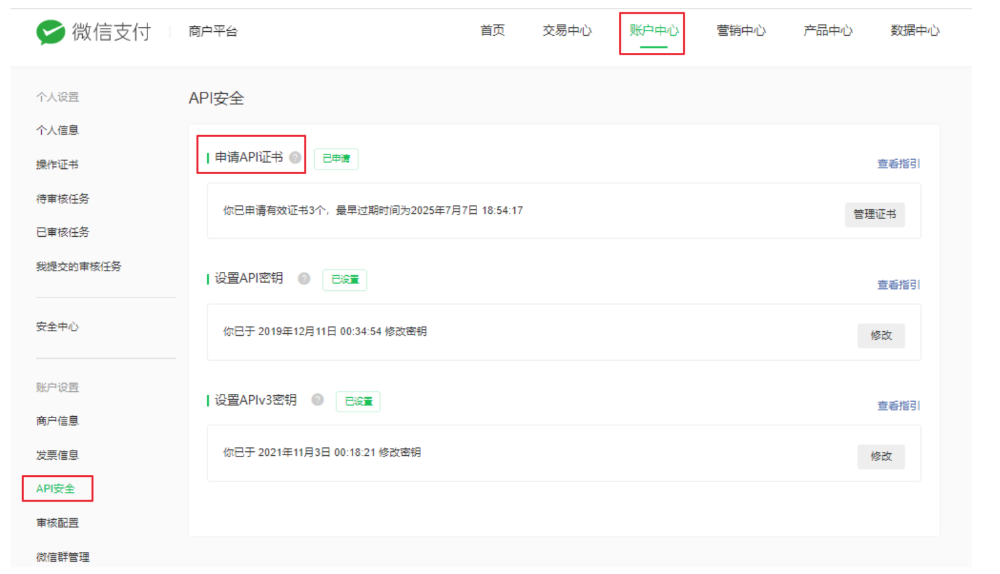
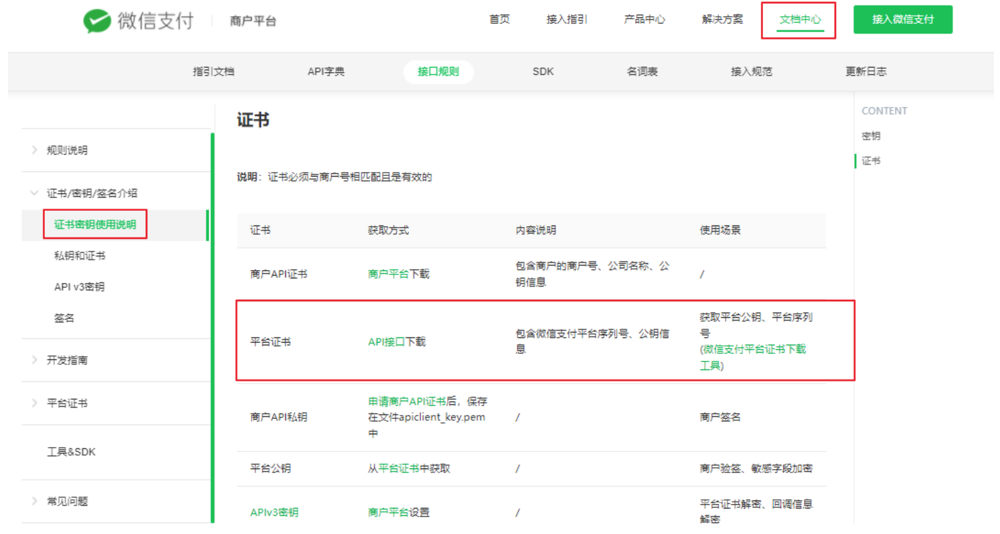

## 1 、信息安全的基础 - 机密性

##### 明文： 加密前的消息叫“明文”（plain text）

##### 密文： 加密后的文本叫“密文”（cipher text）

##### 密钥： 只有掌握特殊“钥匙”的人，才能对加密的文本进行解密，这里的“钥匙”就叫做“密钥”（key）

##### “密钥”就是一个字符串，度量单位是“位”（bit），比如，密钥长度是 128 ，就是 16 字节的二

##### 进制串

##### 加密： 实现机密性最常用的手段是“加密”（encrypt）

##### 按照密钥的使用方式，加密可以分为两大类： 对称加密和非对称加密 。

##### 解密： 使用密钥还原明文的过程叫“解密”（decrypt）

##### 加密算法： 加密解密的操作过程就是“加密算法”

##### 所有的加密算法都是公开的，而算法使用的“密钥”则必须保密

## 2 、对称加密和非对称加密

##### 对称加密

##### 特点：只使用一个密钥，密钥必须保密，常用的有 AES算法

##### 优点：运算速度快

##### 缺点：秘钥需要信息交换的双方共享，一旦被窃取，消息会被破解，无法做到安全的密钥交

##### 换

##### 非对称加密

##### 特点：使用两个密钥：公钥和私钥，公钥可以任意分发而私钥保密，常用的有 RSA

##### 优点：黑客获取公钥无法破解密文，解决了密钥交换的问题

##### 缺点：运算速度非常慢

##### 混合加密

##### 实际场景中把对称加密和非对称加密结合起来使用。

## 3 、身份认证

##### 公钥加密，私钥解密的作用是加密信息

##### 私钥加密，公钥解密的作用是身份认证

## 4 、摘要算法（Digest Algorithm）

##### 摘要算法就是我们常说的散列函数、哈希函数（Hash Function），它能够把任意长度的数据“压缩”成

##### 固定长度、而且独一无二的“摘要”字符串，就好像是给这段数据生成了一个数字“指纹”。

##### 作用 ：

##### 保证信息的完整性

##### 特性 ：

##### 不可逆：只有算法，没有秘钥，只能加密，不能解密

##### 难题友好性：想要破解，只能暴力枚举

##### 发散性：只要对原文进行一点点改动，摘要就会发生剧烈变化

##### 抗碰撞性：原文不同，计算后的摘要也要不同

##### 常见摘要算法 ：

##### MD5、SHA1、SHA2（SHA224、SHA256、SHA384）

## 5 、数字签名

##### 数字签名是使用私钥对摘要加密生成签名，需要由公钥将签名解密后进行验证，实现身份认证和不可否

##### 认

##### 签名和验证签名的流程 ：

## 6 、数字证书

##### 数字证书解决“公钥的信任”问题，可以防止黑客伪造公钥。

##### 不能直接分发公钥，公钥的分发必须使用数字证书，数字证书由CA颁发

##### https协议中的数字证书：

## 7 、微信APIv3证书

##### 商户证书 ：

##### 商户API证书是指由商户申请的，包含商户的商户号、公司名称、公钥信息的证书。

##### 商户证书在商户后台申请：https://pay.weixin.qq.com/index.php/core/cert/api_cert#/

##### 平台证书（微信支付平台）：

##### 微信支付平台证书是指由微信支付 负责申请的，包含微信支付平台标识、公钥信息的证书。商户可以使

##### 用平台证书中的公钥进行验签。

##### 平台证书的获取：https://pay.weixin.qq.com/wiki/doc/apiv3/wechatpay/wechatpay3_0.shtml

## 8 、API密钥和APIv3密钥

##### 都是对称加密需要使用的加密和解密密钥，一定要保管好，不能泄露。

##### API密钥对应V2版本的API

##### APIv3密钥对应V3版本的API
